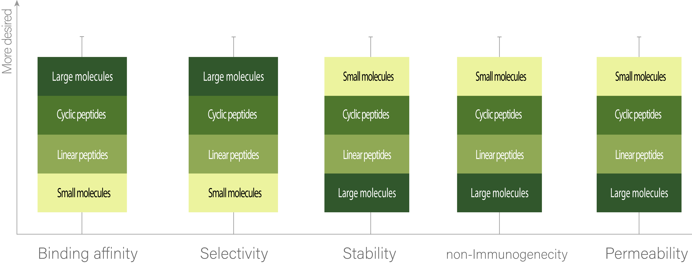

1. Membrane permeability of cyclic peptides

Cyclic peptides are an emerging category of therapeutics. There are several attributes that make cyclic peptides a desirable therapeutic agent. In Fig. 1, some of these drug-favorable properties are compared among different categories of therapeutics. As it can be seen, cyclic peptides can have high binding affinity and selectivity without losing stability or increasing immunogenic responses. This mostly is related to their size, which lies in between small molecules (<500 Da) and large molecules (>5000 Da), and allows them to retain both the rigidity of small molecules for stability and less immunogenicity and wide surface area of large molecules for better binding affinity. In terms of permeability, even though many peptides (cyclic or linear) can not pass the cell membrane, there still are some cyclic peptides, like Cyclosporine A, that have a high permeability. Also, generally, it’s been shown that cyclic peptides are more permeable than their linear counterparts. 

